# MySQL-Workbench. Основы баз данных. Базовые запросы SQL. 
Здесь можно посмотреть базовые запросы __SQL__ в программе __MySQL Workbench__ для таблицы: 

__Список команд: CREATE, SELECT, WHERE, DROP, INSERT, UPDATE, ORDER BY, LIMIT, DELETE.__

# CREATE
```
CREATE TABLE `amperka`.`kits` (
  `id` INT NOT NULL AUTO_INCREMENT,
  `product` VARCHAR(100) NOT NULL,
  `quantity` VARCHAR(100) NOT NULL,
  `price` INT NOT NULL,
  `сollection` VARCHAR(45) NOT NULL,
  PRIMARY KEY (`id`))
ENGINE = InnoDB
DEFAULT CHARACTER SET = utf8
COLLATE = utf8_bin;
 ```
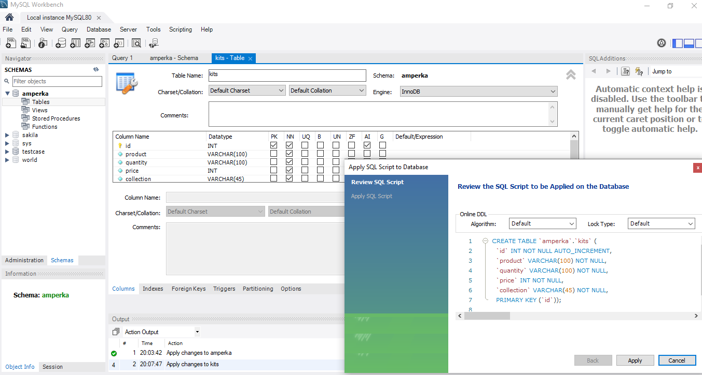

```
CREATE TABLE `amperka`.`kits` (
  `id` INT NOT NULL AUTO_INCREMENT,
  `product` VARCHAR(100) NOT NULL,
  `quantity` VARCHAR(100) NOT NULL,
  `price` INT NOT NULL,
  `сollection` VARCHAR(45) NOT NULL,
  `region` VARCHAR(45) NOT NULL,
  PRIMARY KEY (`id`))
ENGINE = InnoDB;
 ```
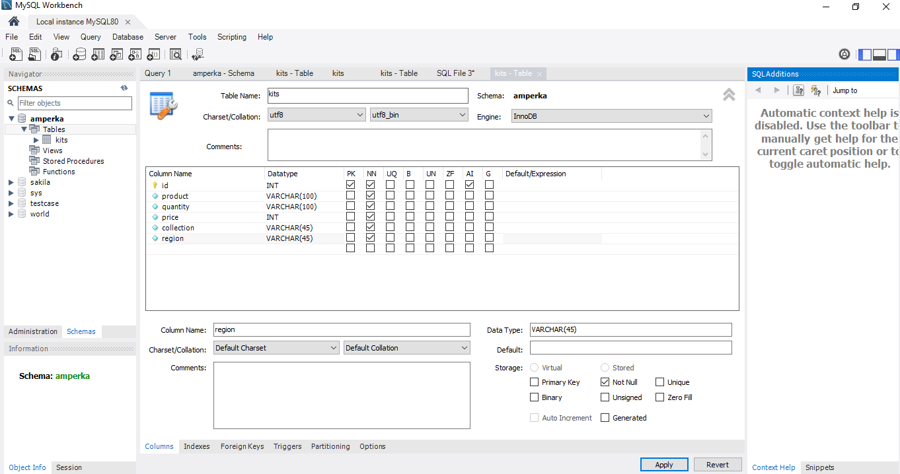
# SELECT
```
SELECT * FROM amperka.kits;
 ```
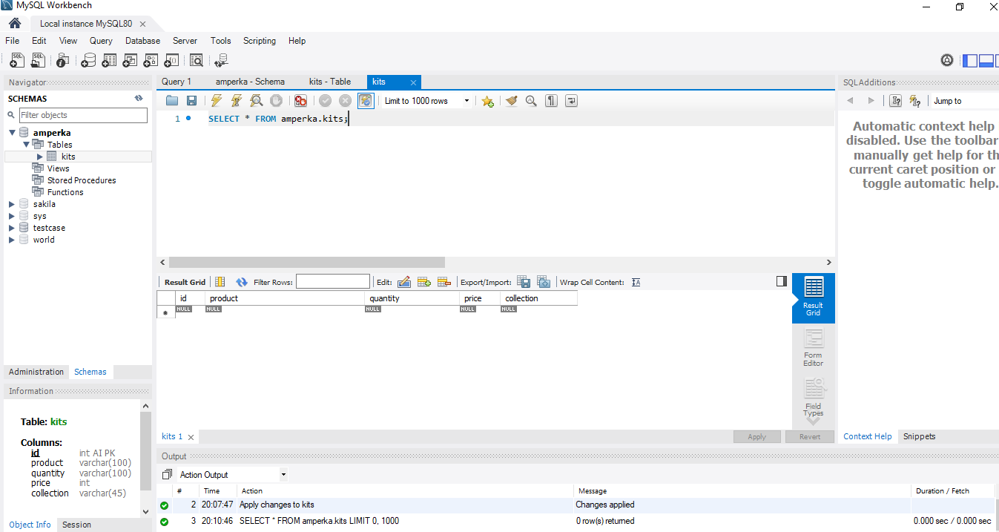

```
use amperka;
SELECT * FROM kits;
 ```
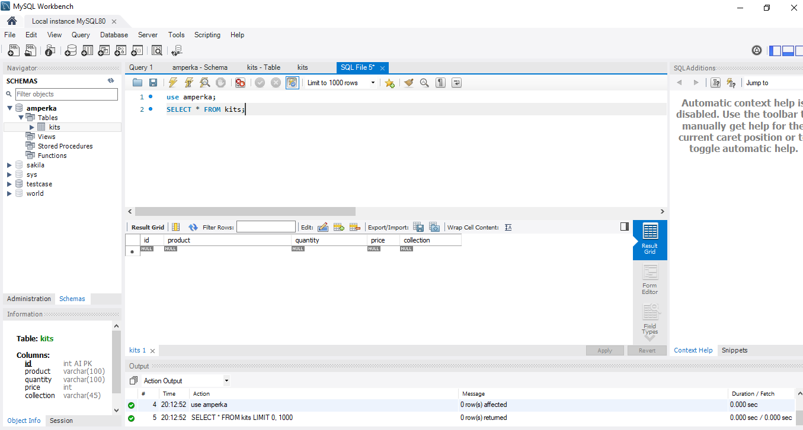

```
SELECT product, сollection FROM kits;
 ```
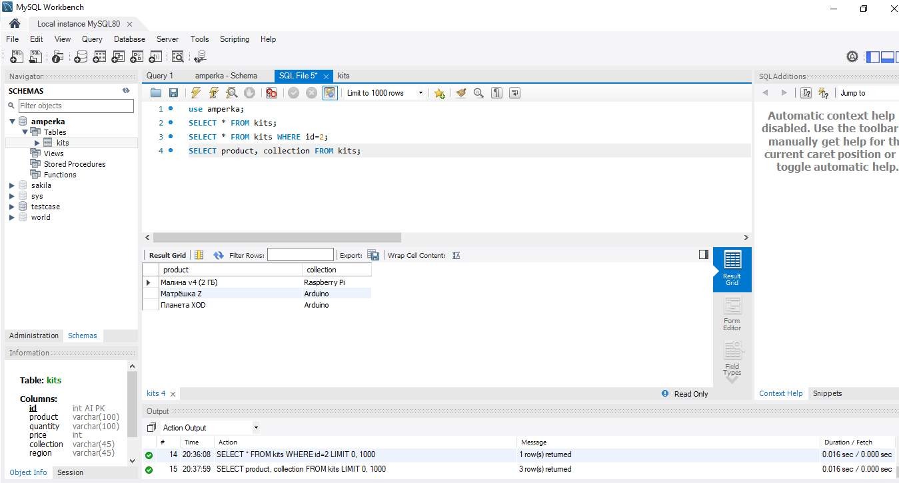
# WHERE
```
SELECT * FROM kits WHERE id=2;
 ```
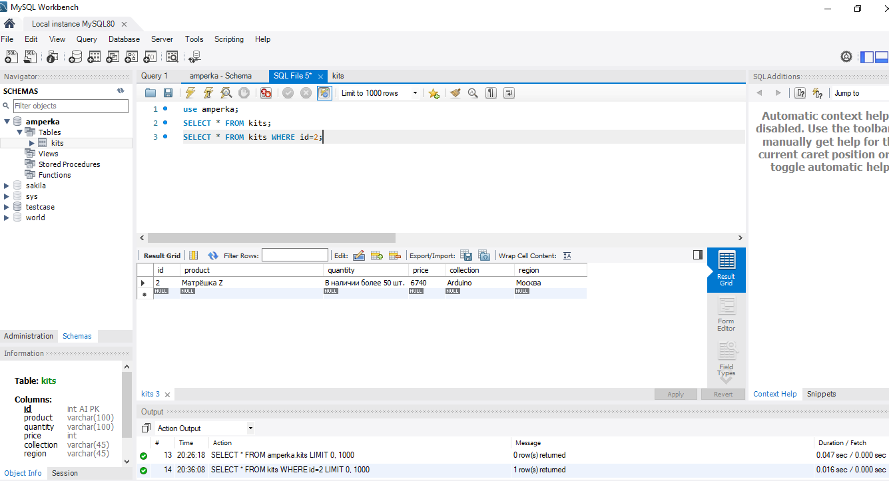

```
SELECT * FROM kits WHERE (product='CyberLight') OR (сollection='Arduino') LIMIT 2;
 ```
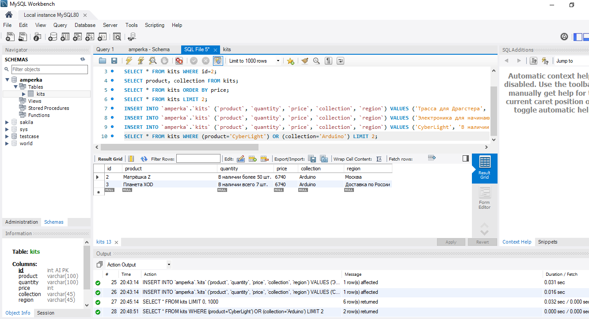

```
SELECT * FROM kits WHERE (price>6000) AND (region='Москва');
 ```
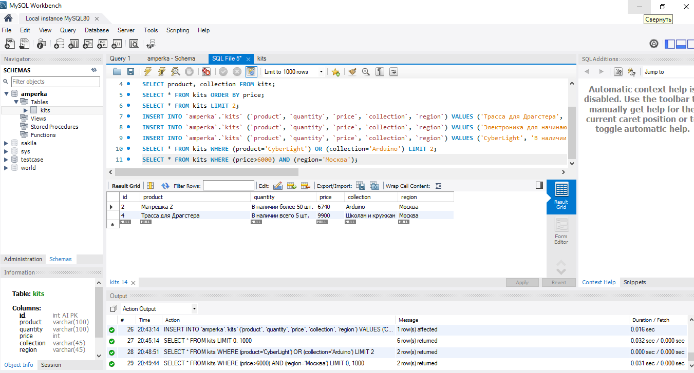
# DROP
```
DROP TABLE `amperka`.`kits`;
 ```
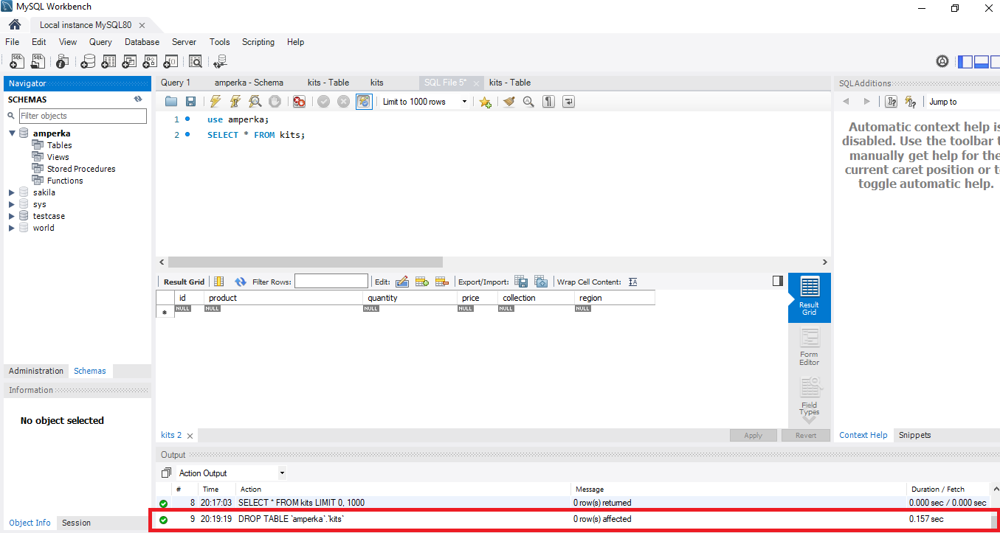
# INSERT
```
INSERT INTO `amperka`.`kits` (`product`, `quantity`, `price`, `сollection`, `region`) VALUES ('Малина v4 (2 ГБ)', 'Сейчас нет', '18490', 'Raspberry Pi', 'Санкт-Петербург');
INSERT INTO `amperka`.`kits` (`product`, `quantity`, `price`, `сollection`, `region`) VALUES ('Матрёшка Z', 'В наличии более 50 шт.', '6740', 'Arduino', 'Москва');
INSERT INTO `amperka`.`kits` (`product`, `quantity`, `price`, `сollection`, `region`) VALUES ('Планета XOD', 'В наличии всего 7 шт.', '6740', 'Arduino', 'Доставка по России');
 ```
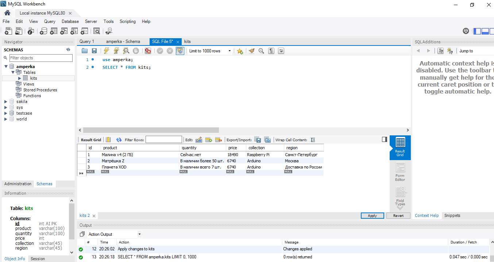

```
INSERT INTO `amperka`.`kits` (`product`, `quantity`, `price`, `сollection`, `region`) VALUES ('Трасса для Драгстера', 'В наличии всего 5 шт.', '9900', 'Школам и кружкам', 'Москва');
INSERT INTO `amperka`.`kits` (`product`, `quantity`, `price`, `сollection`, `region`) VALUES ('Электроника для начинающих (часть 1)', 'В наличии всего 7 шт.', '5490', 'Детям', 'Москва');
INSERT INTO `amperka`.`kits` (`product`, `quantity`, `price`, `сollection`, `region`) VALUES ('CyberLight', 'В наличии более 10 шт.', '640', 'Пайка', 'Доставка по России');
 ```
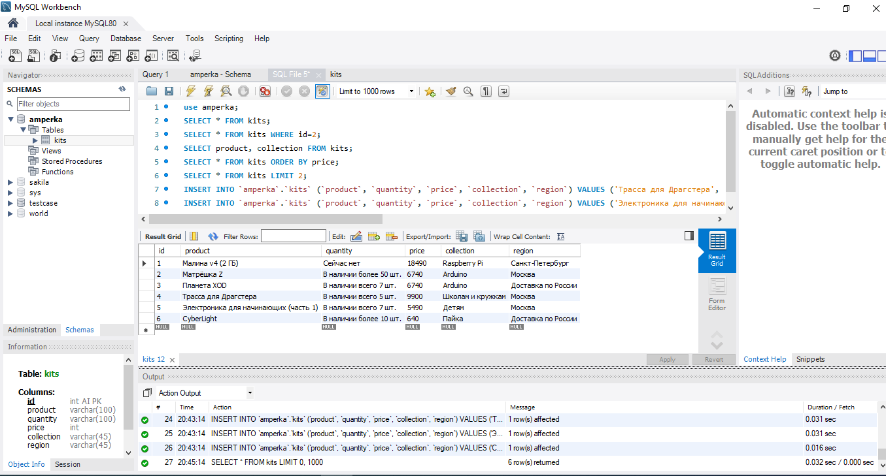
# UPDATE
```
UPDATE kits SET quantity ='В наличии всего 10 шт' Where id>5;
 ```
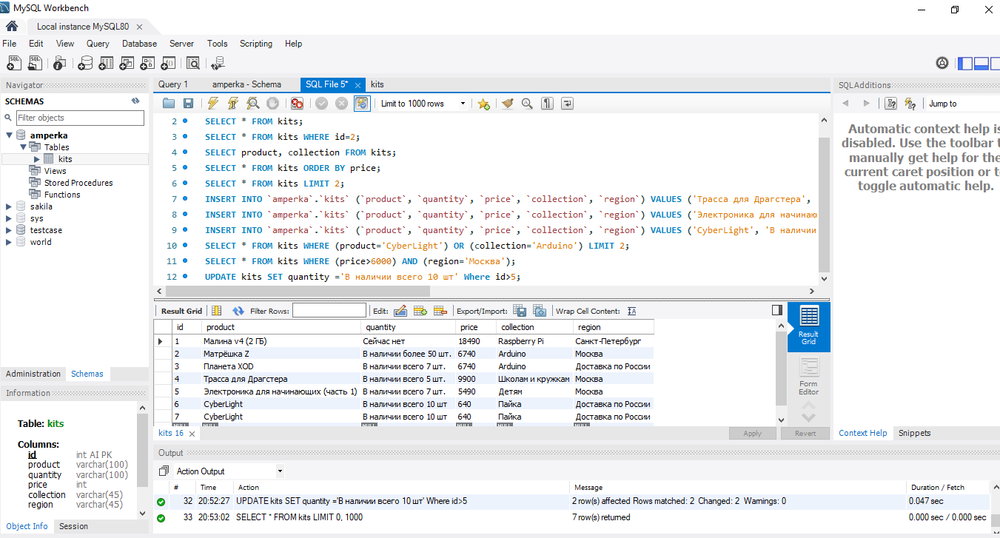
# ORDER BY
```
SELECT * FROM kits ORDER BY price;
 ```
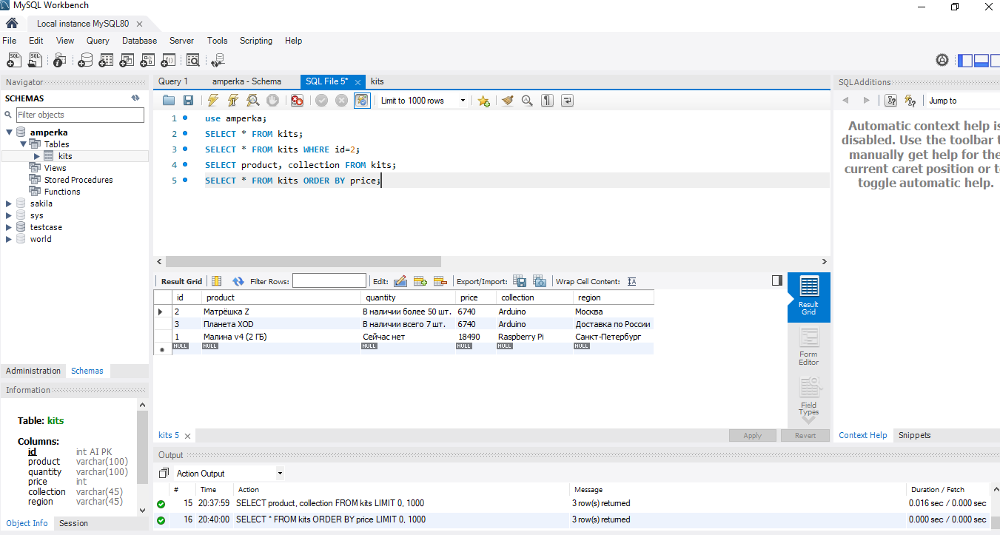
# LIMIT
```
SELECT * FROM kits LIMIT 2;
 ```
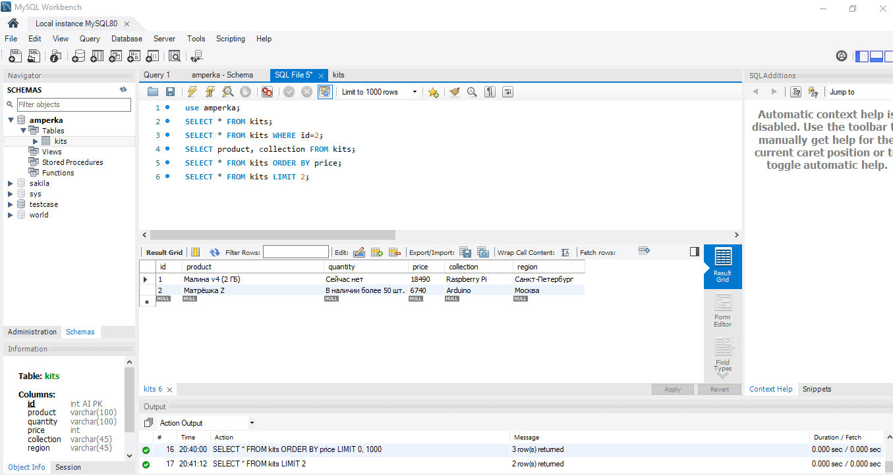
# DELETE
```
DELETE FROM kits WHERE id>6;
 ```
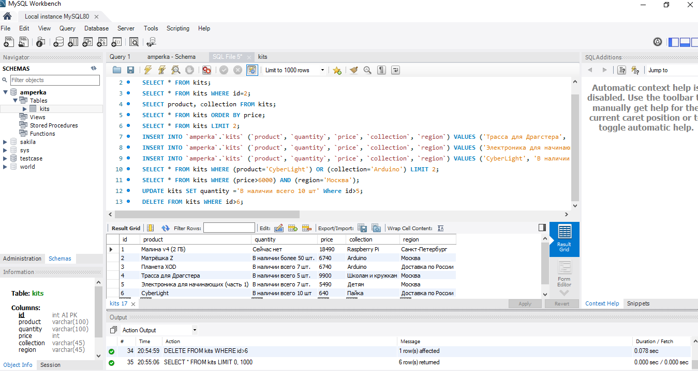
